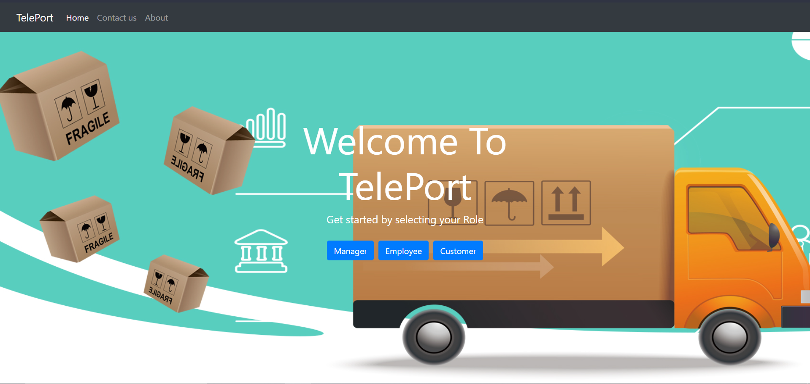
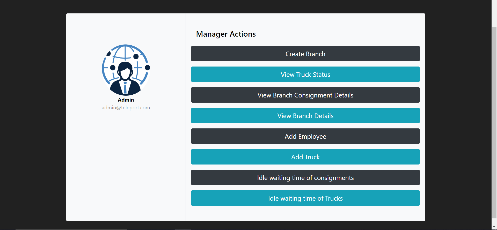
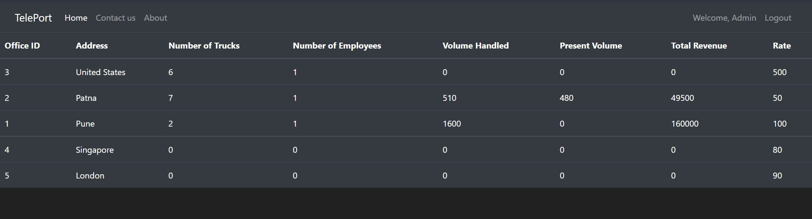
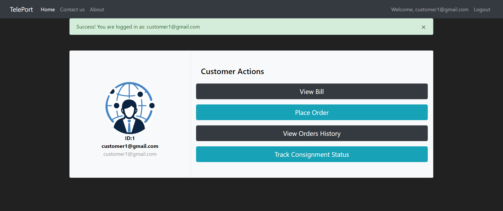
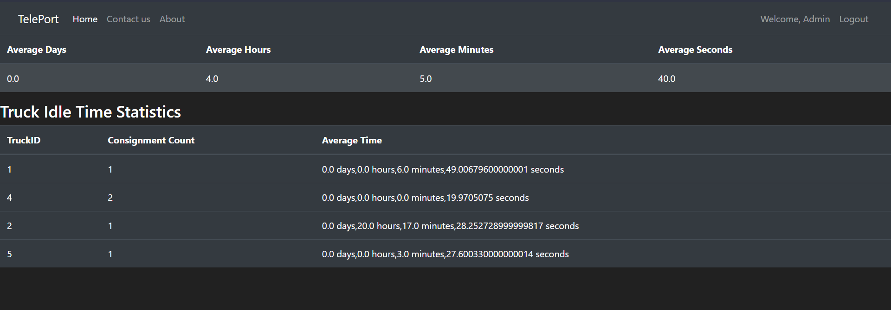
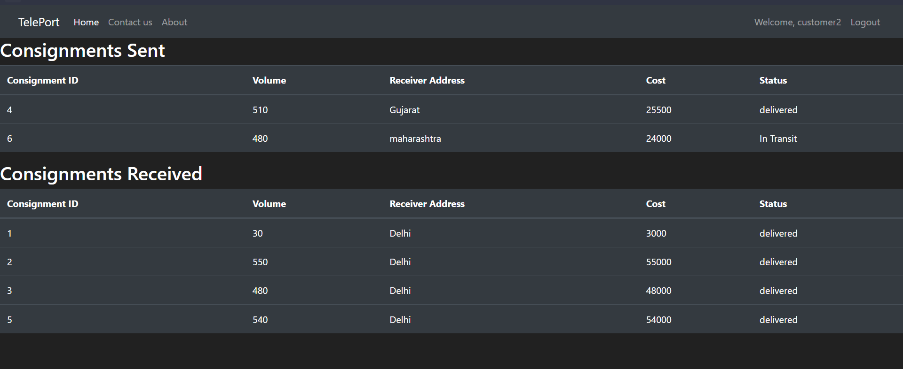

# TCCS - TelePort
TelePort is a Online Delivery Management Software where a customer can send,receive and track orders in a single place. The Software computerizes any delivery company’s book keeping activities associated with its operation with an efficient Truck Allotement and Dispatch Algorithm to ensure productivity resources available.

<div style="margin: 10px 0;" align="center">
  
  
  
  
  
  
  
  
</div>

## Visit the Site
The Webiste is Hosted on Render, you can view the website by clicking [here](https://teleport-g0vz.onrender.com/) 

## Remote Usage
To remotely use the codebase to host the website on your system, clone the repository on your system and do the Following Steps -

1.  Create a `.env` file according to the instructions:
```yaml
host=<host-of-psql-server>
port=<port-of-psql-server>
database=<psql-db-name>
secret_key=<secret-key-for-bcrypt>
user=<psql-db-user>
pool_mode=<psql-pool-mode>
password=<psql-password>

```
2.  Execute the Following line in the root folder to install all the requirements
```bash
pip install -r requirements.txt
```
3.  To Finally Run the Codebase, in the root directory, run the following command in the terminal
```python
python app.py
```

## Project Structure
```
teleport/
├── app.py                     # Main Flask application
├── forms.py                   # Form definitions
├── models.py                  # Database models
├── requirements.txt           # Project dependencies
├── routes.py                  # Application routes
├── .env                       # Environment variables
│
├── migrations/                # Database migrations
│   ├── versions/
│   ├── alembic.ini
│   ├── env.py
│   └── script.py.mako
│
├── static/
│   ├── images/                # Image assets
│   └── styles/
│       ├── about.css
│       └── login.css
│
└── templates/                 # HTML templates
    ├── base.html              # Base template
    ├── index.html         
    ├── login/             
    │   ├── login.html
    │   └── signup.html
    ├── customer/
    │   └── dashboard.html
    ├── employee/
    │   └── dashboard.html
    └── manager/
        └── dashboard.html
```

## Application Screenshots

<table>
  <tr>
    <td align="center">
      <br/>
      <b>Home Page</b> - Landing page with login options
    </td>
    <td align="center">
      <br/>
      <b>Manager Dashboard</b> - Overview of operations
    </td>
  </tr>
  <tr>
    <td align="center">
      <br/>
      <b>Branch Statistics</b> - Performance metrics by location
    </td>
    <td align="center">
      <br/>
      <b>Customer Dashboard</b> - Order management interface
    </td>
  </tr>
  <tr>
    <td align="center">
      <br/>
      <b>Truck Idle Statistics</b> - Fleet utilization analysis
    </td>
    <td align="center">
      <br/>
      <b>Customer Order History</b> - Past orders and tracking
    </td>
  </tr>
</table>
